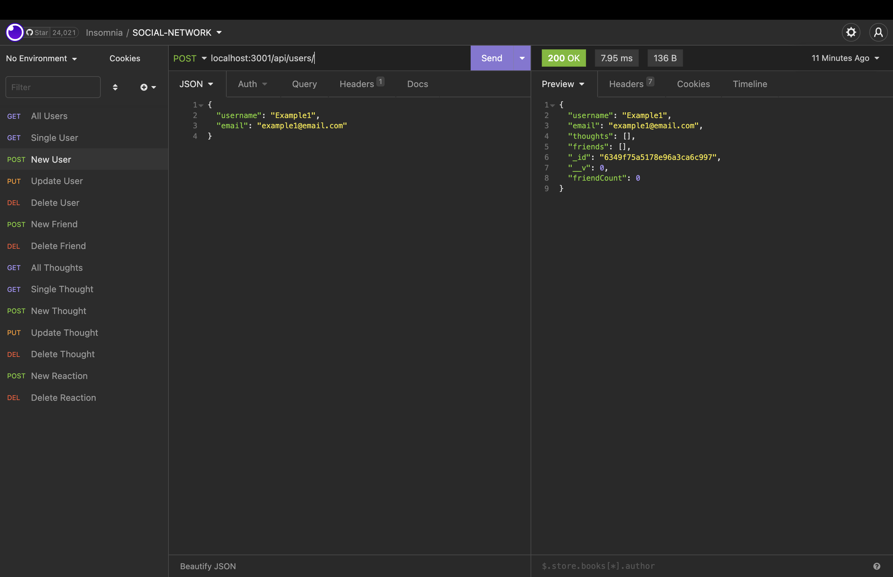
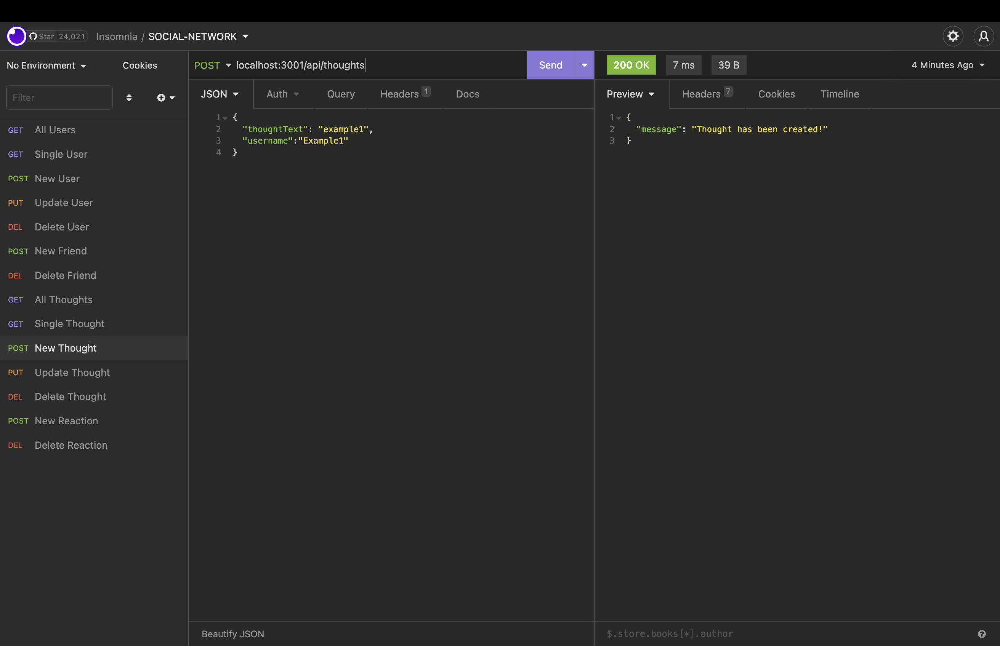
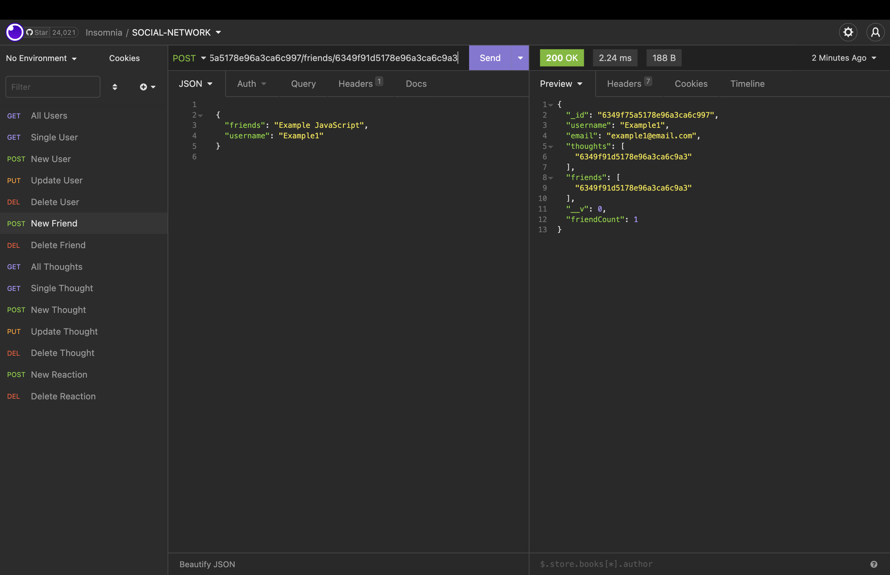
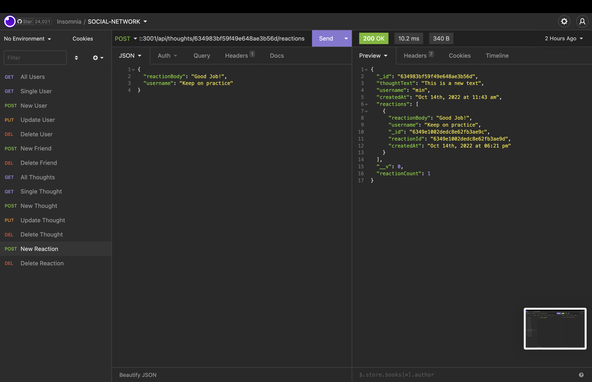

# Social-Network-Api

This Social Network Api app uses a NoSQL database, which can handle large amounts of unstructured data. With this web application, users can share their thoughts, react to friends' thoughts and create a friend list.

## Description

- User can enter the command to invoke the application
- User can open API GET routes in Insomnia for users and thoughts
- User can test API POST, PUT, and DELETE routes in Insomnia

## Mock-Up

## Click the Links:

[Github:](git@github.com:Minmaung0307/18-social-network-api.git)

[URL:1](https://minmaung0307.github.io/18-social-network-api/)

[URL:2](https://github.com/Minmaung0307/18-social-network-api)

[Video:](https://watch.screencastify.com/v/FPV2YW3r2G8yZURa7JUE)
